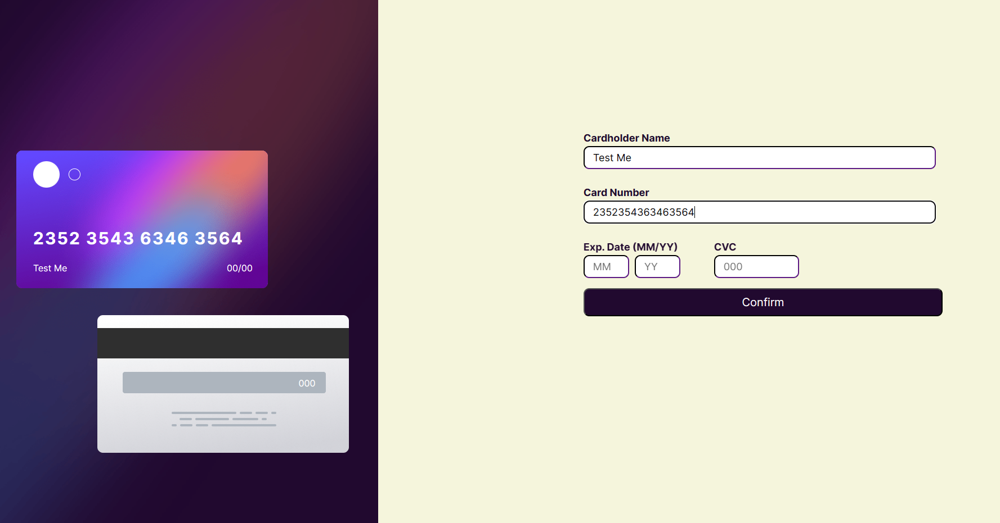
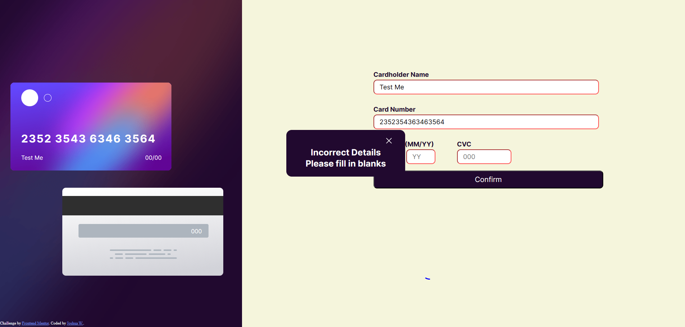
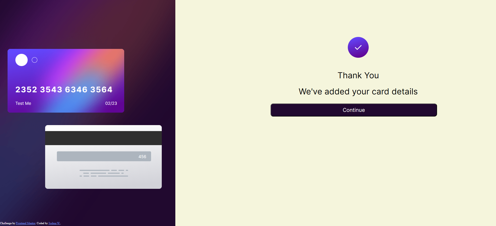

# Frontend Mentor - Interactive card details form solution

This is a solution to the [Interactive card details form challenge on Frontend Mentor](https://www.frontendmentor.io/challenges/interactive-card-details-form-XpS8cKZDWw). Frontend Mentor challenges help you improve your coding skills by building realistic projects. 

## Table of contents

- [Overview](#overview)
  - [The challenge](#the-challenge)
  - [Screenshot](#screenshot)
  - [Links](#links)
- [My process](#my-process)
  - [Built with](#built-with)
  - [What I learned](#what-i-learned)
  - [Useful resources](#useful-resources)
- [Author](#author)

## Overview

### The challenge

Users should be able to:

- Fill in the form and see the card details update in real-time
- Receive error messages when the form is submitted if:
  - Any input field is empty
  - The card number, expiry date, or CVC fields are in the wrong format
- View the optimal layout depending on their device's screen size
- See hover, active, and focus states for interactive elements on the page

### Screenshot
- Here are screenshot of the project in different stages. 




### Links

- Solution URL: [Github Repo ](https://github.com/J-Wil21/Interactive-Display/tree/main)
- Live Site URL: [live site](j-wil21.github.io/Interactive-Display/)

## My process

### Built with

- Semantic HTML5 markup
- CSS custom properties
- Flexbox
- JavaScript

### What I learned

When building a project which requires an interactive function. I realised that it would be better to write a working program give the functionality to the page before styling the page.
By doing this I won't be having to change the styling which I had to do multiple times because I created the style before handling the functionality.

I also learnt that i should of created this project with a moblie first view. As I didn't, I had to created multiple '@media' queries in order to make sure the card fit the screen. 

Using comments in another point I had to learn and use. For example when i was writing down the functions I had to write down a small comment just to let me know what it was doing. 

See below a few example:
```//Function to turn boxes red (On & Off)

function redOn() {
        cardName.classList.add('red');
        cardNum.classList.add('red');
        cvc.classList.add('red');
        expDateM.classList.add('red');
        expDateY.classList.add('red');
}
```
```
//function to check if text is in input box
function checkInput(cardName, value16, value3, dateY2, dateM2) {
    if (
        cardName.trim().length === 0 ||
        value16.length !== 16 ||
        value3.length !== 3 ||
        dateY2.length !== 2 ||
        dateM2.length !== 2) {
        //apply css to make textbox red
        redOn();
        box.style.display = 'block'
    } else {
        hideForm();
        redOff();
    };
}
```

### Useful resources

- [Chatgpt](https://chat.openai.com/) - This helped me to figure out how to code the interactive part of the project
- [MDN](https://developer.mozilla.org/en-US/) - This is a website that gives info about HTML, CSS and JS. this helped a lot in remembering what experession or methods to use in my code

## Author

- Github - [Joshua](https://github.com/J-Wil21)
- Frontend Mentor - [@J-Wil21](https://www.frontendmentor.io/profile/J-Wil21)
